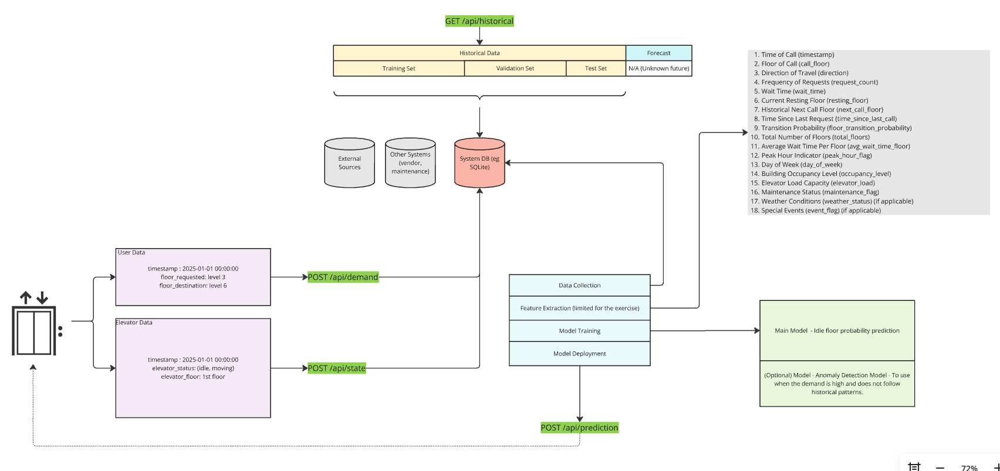
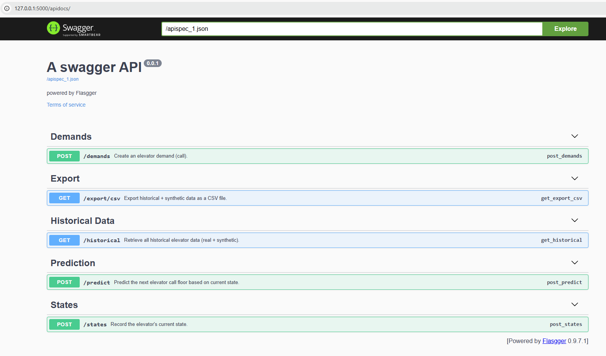

# Elevator Model by Diego Cerda



## Running the Project

To run the project, follow these steps:

1. Ensure you have all the necessary dependencies installed. You can install them using:

    ```sh
    pip install -r requirements.txt
    ```

2. Navigate to the project directory:

    ```sh
    cd devtest
    ```

3. Initialize the database:

    ```sh
    flask db init
    flask db migrate
    flask db upgrade
    ```

4. Run the Flask application:

    ```sh
    flask run
    ```

The application will be available at `http://127.0.0.1:5000`.

## Running Tests

To run the tests, follow these steps:

1. Ensure you have all the necessary dependencies installed.
2. Navigate to the project directory:

    ```sh
    cd devtest
    ```

3. Run the tests using pytest:

    ```sh
    pytest
    ```

## API Documentation

The API documentation is available at:

[Swagger UI](http://127.0.0.1:5000/apidocs/)

## Assumptions / Considerations

- Elevator Environment (store, hotel) has an impact on the demand and use.
- Some elevators won't accept new requests when in transit.
- An elevator can rest on different floors at different times.
- Detects current demand, e.g., if someone is moving into an apartment, there may be lots of demand on floors 2 to 6.



